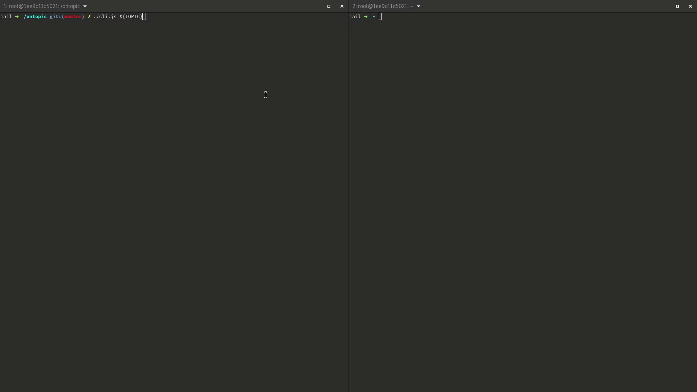

[](https://www.npmjs.com/package/ontopic)

# ontopic

`ontopic` let's you listen to [SNS](https://aws.amazon.com/sns) notifications from you command line.  
It does so by creating an [SQS](https://aws.amazon.com/sqs) queue subscribed to the topic and polling it. 
Before the process exits the created resources are removed.  



You must have your `AWS` account correctly configured on your machine for `ontopic` to work.

## Installation
```
npm install -g ontopic
```

## Usage
Basic usage:
```
ontopic <TOPIC_ARN>
```

For more see `--help`:
```
$ ontopic --help
usage: ontopic [-h] [-v] [-r REGION] topicArn

Listen to SNS notifications

Positional arguments:
  topicArn              The SNS Topic ARN to subscribe to.

Optional arguments:
  -h, --help            Show this help message and exit.
  -v, --version         Show program's version number and exit.
  -r REGION, --region REGION
                        AWS region to use for the queue. If absent, it will 
                        be set to the environment variable AWS_DEFAULT_REGION,
                        AWS_REGION or defaulted to eu-central-1.
```
